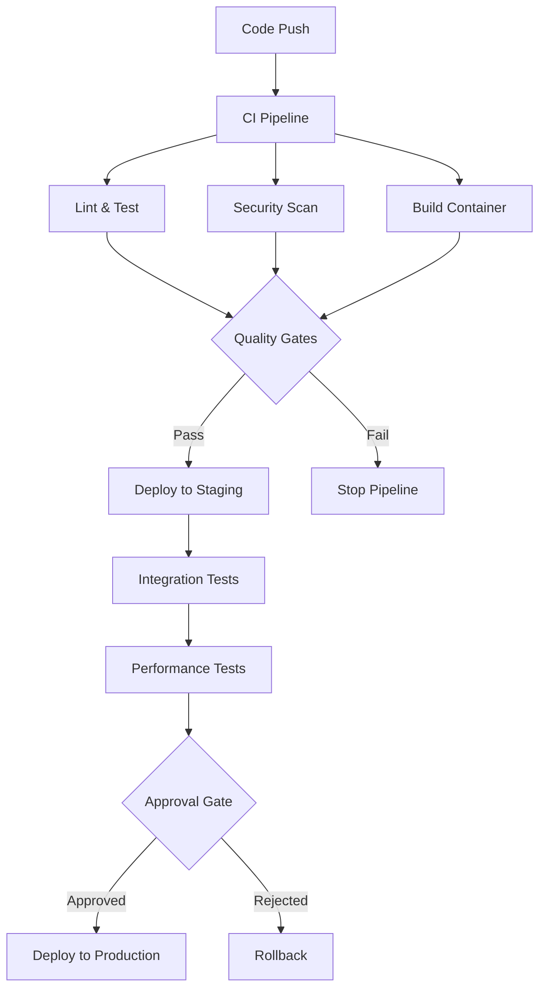

# 🔄 CI/CD Setup Guide - Nimify Anything

This guide provides comprehensive CI/CD pipeline configurations for automated testing, building, and deployment of Nimify services.

## 📋 Overview

Our CI/CD pipeline includes:
- **Continuous Integration**: Automated testing, linting, security scanning
- **Continuous Deployment**: Automated building, containerization, and deployment
- **Quality Gates**: Performance benchmarks, security checks, compliance validation
- **Multi-environment**: Development, staging, and production deployments

## 🏗️ Pipeline Architecture



## 🔧 GitHub Actions

### Main CI/CD Workflow

```yaml
# .github/workflows/ci-cd.yml
name: CI/CD Pipeline

on:
  push:
    branches: [main, develop]
  pull_request:
    branches: [main]
  release:
    types: [published]

env:
  REGISTRY: ghcr.io
  IMAGE_NAME: ${{ github.repository }}
  PYTHON_VERSION: "3.10"

jobs:
  # ===============================
  # CONTINUOUS INTEGRATION
  # ===============================
  
  lint-and-format:
    name: Lint and Format
    runs-on: ubuntu-latest
    steps:
      - name: Checkout code
        uses: actions/checkout@v4

      - name: Set up Python
        uses: actions/setup-python@v4
        with:
          python-version: ${{ env.PYTHON_VERSION }}

      - name: Cache dependencies
        uses: actions/cache@v3
        with:
          path: ~/.cache/pip
          key: ${{ runner.os }}-pip-${{ hashFiles('**/pyproject.toml') }}

      - name: Install dependencies
        run: |
          python -m pip install --upgrade pip
          pip install -e ".[dev]"

      - name: Run black formatter
        run: black --check --diff src/ tests/

      - name: Run ruff linter
        run: ruff check src/ tests/

      - name: Run mypy type checker
        run: mypy src/

  test:
    name: Run Tests
    runs-on: ubuntu-latest
    strategy:
      matrix:
        python-version: ["3.10", "3.11", "3.12"]
    
    steps:
      - name: Checkout code
        uses: actions/checkout@v4

      - name: Set up Python ${{ matrix.python-version }}
        uses: actions/setup-python@v4
        with:
          python-version: ${{ matrix.python-version }}

      - name: Install dependencies
        run: |
          python -m pip install --upgrade pip
          pip install -e ".[test]"

      - name: Run tests with coverage
        run: |
          pytest tests/ --cov=src --cov-report=xml --cov-report=term-missing

      - name: Upload coverage to Codecov
        uses: codecov/codecov-action@v3
        with:
          file: ./coverage.xml
          flags: unittests
          name: codecov-umbrella

  security-scan:
    name: Security Scan
    runs-on: ubuntu-latest
    permissions:
      security-events: write
      actions: read
      contents: read

    steps:
      - name: Checkout code
        uses: actions/checkout@v4

      - name: Set up Python
        uses: actions/setup-python@v4
        with:
          python-version: ${{ env.PYTHON_VERSION }}

      - name: Install security tools
        run: |
          python -m pip install --upgrade pip
          pip install bandit[toml] safety detect-secrets

      - name: Run Bandit security linter
        run: |
          bandit -r src/ -f json -o bandit-report.json
        continue-on-error: true

      - name: Run Safety vulnerability scanner
        run: |
          safety check --json --output safety-report.json
        continue-on-error: true

      - name: Run detect-secrets scanner
        run: |
          detect-secrets scan --all-files --baseline .secrets.baseline
          detect-secrets audit .secrets.baseline --report --output-file secrets-report.json
        continue-on-error: true

      - name: Upload security reports
        uses: actions/upload-artifact@v3
        with:
          name: security-reports
          path: |
            bandit-report.json
            safety-report.json
            secrets-report.json

  # ===============================
  # BUILD AND CONTAINERIZE
  # ===============================

  build:
    name: Build Container
    runs-on: ubuntu-latest
    needs: [lint-and-format, test, security-scan]
    permissions:
      contents: read
      packages: write

    outputs:
      image-digest: ${{ steps.build.outputs.digest }}
      image-tag: ${{ steps.meta.outputs.tags }}

    steps:
      - name: Checkout code
        uses: actions/checkout@v4

      - name: Set up Docker Buildx
        uses: docker/setup-buildx-action@v3

      - name: Log in to Container Registry
        uses: docker/login-action@v3
        with:
          registry: ${{ env.REGISTRY }}
          username: ${{ github.actor }}
          password: ${{ secrets.GITHUB_TOKEN }}

      - name: Extract metadata
        id: meta
        uses: docker/metadata-action@v5
        with:
          images: ${{ env.REGISTRY }}/${{ env.IMAGE_NAME }}
          tags: |
            type=ref,event=branch
            type=ref,event=pr
            type=semver,pattern={{version}}
            type=semver,pattern={{major}}.{{minor}}
            type=sha,prefix=sha-

      - name: Build and push container
        id: build
        uses: docker/build-push-action@v5
        with:
          context: .
          file: ./Dockerfile.production
          platforms: linux/amd64,linux/arm64
          push: true
          tags: ${{ steps.meta.outputs.tags }}
          labels: ${{ steps.meta.outputs.labels }}
          cache-from: type=gha
          cache-to: type=gha,mode=max
          build-args: |
            BUILDKIT_INLINE_CACHE=1

  # ===============================
  # CONTAINER SECURITY SCANNING
  # ===============================

  container-scan:
    name: Container Security Scan
    runs-on: ubuntu-latest
    needs: build
    permissions:
      security-events: write

    steps:
      - name: Run Trivy vulnerability scanner
        uses: aquasecurity/trivy-action@master
        with:
          image-ref: ${{ needs.build.outputs.image-tag }}
          format: 'sarif'
          output: 'trivy-results.sarif'

      - name: Upload Trivy scan results to GitHub Security tab
        uses: github/codeql-action/upload-sarif@v2
        if: always()
        with:
          sarif_file: 'trivy-results.sarif'

  # ===============================
  # DEPLOYMENT TO STAGING
  # ===============================

  deploy-staging:
    name: Deploy to Staging
    runs-on: ubuntu-latest
    needs: [build, container-scan]
    if: github.ref == 'refs/heads/develop' || github.ref == 'refs/heads/main'
    environment: staging

    steps:
      - name: Checkout code
        uses: actions/checkout@v4

      - name: Set up Kubectl
        uses: azure/k8s-set-context@v1
        with:
          method: kubeconfig
          kubeconfig: ${{ secrets.KUBE_CONFIG_STAGING }}

      - name: Set up Helm
        uses: azure/setup-helm@v1
        with:
          version: '3.14.0'

      - name: Deploy to staging
        run: |
          helm upgrade --install nimify-staging ./helm/nimify-anything/ \
            --namespace nimify-staging \
            --create-namespace \
            --set image.tag=${{ github.sha }} \
            --set environment=staging \
            --values ./helm/values-staging.yaml \
            --wait --timeout=10m

      - name: Verify deployment
        run: |
          kubectl rollout status deployment/nimify-staging -n nimify-staging
          kubectl get pods -n nimify-staging

  # ===============================
  # INTEGRATION TESTS
  # ===============================

  integration-tests:
    name: Integration Tests
    runs-on: ubuntu-latest
    needs: deploy-staging
    if: github.ref == 'refs/heads/develop' || github.ref == 'refs/heads/main'

    steps:
      - name: Checkout code
        uses: actions/checkout@v4

      - name: Set up Python
        uses: actions/setup-python@v4
        with:
          python-version: ${{ env.PYTHON_VERSION }}

      - name: Install test dependencies
        run: |
          pip install requests pytest httpx

      - name: Wait for service to be ready
        run: |
          kubectl wait --for=condition=available deployment/nimify-staging -n nimify-staging --timeout=300s

      - name: Get service endpoint
        run: |
          STAGING_URL=$(kubectl get svc nimify-staging -n nimify-staging -o jsonpath='{.status.loadBalancer.ingress[0].hostname}')
          echo "STAGING_URL=http://$STAGING_URL" >> $GITHUB_ENV

      - name: Run integration tests
        run: |
          pytest tests/integration/ --endpoint=${{ env.STAGING_URL }}

  # ===============================
  # PERFORMANCE TESTS
  # ===============================

  performance-tests:
    name: Performance Tests
    runs-on: ubuntu-latest
    needs: integration-tests
    if: github.ref == 'refs/heads/main'

    steps:
      - name: Checkout code
        uses: actions/checkout@v4

      - name: Set up Python
        uses: actions/setup-python@v4
        with:
          python-version: ${{ env.PYTHON_VERSION }}

      - name: Install dependencies
        run: |
          pip install requests

      - name: Get staging endpoint
        run: |
          STAGING_URL=$(kubectl get svc nimify-staging -n nimify-staging -o jsonpath='{.status.loadBalancer.ingress[0].hostname}')
          echo "STAGING_URL=http://$STAGING_URL" >> $GITHUB_ENV

      - name: Run performance benchmarks
        run: |
          python scripts/performance-benchmark.py \
            --endpoint ${{ env.STAGING_URL }} \
            --users 50 \
            --duration 120 \
            --output performance-report.json

      - name: Upload performance report
        uses: actions/upload-artifact@v3
        with:
          name: performance-report
          path: performance-report.json

      - name: Validate performance SLAs
        run: |
          python scripts/validate-performance-sla.py performance-report.json

  # ===============================
  # PRODUCTION DEPLOYMENT
  # ===============================

  deploy-production:
    name: Deploy to Production
    runs-on: ubuntu-latest
    needs: [performance-tests]
    if: github.event_name == 'release' && github.event.action == 'published'
    environment: production

    steps:
      - name: Checkout code
        uses: actions/checkout@v4

      - name: Set up Kubectl
        uses: azure/k8s-set-context@v1
        with:
          method: kubeconfig
          kubeconfig: ${{ secrets.KUBE_CONFIG_PRODUCTION }}

      - name: Set up Helm
        uses: azure/setup-helm@v1
        with:
          version: '3.14.0'

      - name: Deploy to production
        run: |
          helm upgrade --install nimify-production ./helm/nimify-anything/ \
            --namespace nimify-production \
            --create-namespace \
            --set image.tag=${{ github.ref_name }} \
            --set environment=production \
            --values ./helm/values-production.yaml \
            --wait --timeout=15m

      - name: Verify production deployment
        run: |
          kubectl rollout status deployment/nimify-production -n nimify-production
          kubectl get pods -n nimify-production
          
      - name: Run smoke tests
        run: |
          PROD_URL=$(kubectl get svc nimify-production -n nimify-production -o jsonpath='{.status.loadBalancer.ingress[0].hostname}')
          curl -f http://$PROD_URL/health

  # ===============================
  # NOTIFICATION AND CLEANUP
  # ===============================

  notify-success:
    name: Notify Success
    runs-on: ubuntu-latest
    needs: [deploy-production]
    if: success()

    steps:
      - name: Notify Slack
        uses: 8398a7/action-slack@v3
        with:
          status: success
          fields: repo,message,commit,author,action,eventName,ref,workflow
          webhook_url: ${{ secrets.SLACK_WEBHOOK_URL }}

  cleanup:
    name: Cleanup
    runs-on: ubuntu-latest
    needs: [deploy-production]
    if: always()

    steps:
      - name: Clean up staging environment
        run: |
          kubectl delete namespace nimify-staging --ignore-not-found=true
        continue-on-error: true
```

### Dockerfile for Production

```dockerfile
# Dockerfile.production
# Multi-stage build for optimized production container

# Build stage
FROM python:3.10-slim as builder

WORKDIR /app

# Install build dependencies
RUN apt-get update && apt-get install -y \
    build-essential \
    curl \
    && rm -rf /var/lib/apt/lists/*

# Copy requirements and install Python dependencies
COPY pyproject.toml .
RUN pip install --no-cache-dir build && \
    pip wheel --no-cache-dir --wheel-dir /wheels -e .

# Production stage
FROM nvidia/cuda:12.0-devel-ubuntu20.04

# Install runtime dependencies
RUN apt-get update && apt-get install -y \
    python3 \
    python3-pip \
    curl \
    && rm -rf /var/lib/apt/lists/*

# Create non-root user
RUN groupadd -r nimuser && useradd -r -g nimuser nimuser

# Copy wheels from builder stage
COPY --from=builder /wheels /wheels

# Install Python packages from wheels
RUN pip3 install --no-cache-dir --find-links /wheels nimify-anything[prod] && \
    rm -rf /wheels

# Copy application code
COPY src/ /app/src/
COPY scripts/ /app/scripts/

# Set working directory and user
WORKDIR /app
RUN chown -R nimuser:nimuser /app
USER nimuser

# Health check
HEALTHCHECK --interval=30s --timeout=10s --start-period=60s --retries=3 \
    CMD curl -f http://localhost:8000/health || exit 1

# Expose ports
EXPOSE 8000 9090

# Labels for metadata
LABEL org.opencontainers.image.source="https://github.com/nimify/nimify-anything"
LABEL org.opencontainers.image.description="NVIDIA NIM Microservice"
LABEL org.opencontainers.image.licenses="MIT"

# Start command
CMD ["python3", "-m", "uvicorn", "src.nimify.api:app", \
     "--host", "0.0.0.0", "--port", "8000", "--workers", "1"]
```

## 🦊 GitLab CI/CD

### Complete Pipeline Configuration

```yaml
# .gitlab-ci.yml
stages:
  - validate
  - test
  - security
  - build
  - deploy-staging
  - integration-test
  - deploy-production

variables:
  DOCKER_DRIVER: overlay2
  DOCKER_TLS_CERTDIR: ""
  REGISTRY: $CI_REGISTRY
  IMAGE_NAME: $CI_REGISTRY_IMAGE
  PYTHON_VERSION: "3.10"

# ===============================
# TEMPLATES
# ===============================

.python-base: &python-base
  image: python:${PYTHON_VERSION}-slim
  before_script:
    - python -m pip install --upgrade pip
    - pip install -e ".[dev]"
  cache:
    paths:
      - ~/.cache/pip/

.docker-base: &docker-base
  image: docker:24-dind
  services:
    - docker:24-dind
  before_script:
    - docker login -u $CI_REGISTRY_USER -p $CI_REGISTRY_PASSWORD $CI_REGISTRY

# ===============================
# VALIDATION STAGE
# ===============================

lint:
  <<: *python-base
  stage: validate
  script:
    - black --check --diff src/ tests/
    - ruff check src/ tests/
    - mypy src/
  artifacts:
    reports:
      junit: lint-report.xml

format-check:
  <<: *python-base
  stage: validate
  script:
    - black --check --diff src/ tests/
  allow_failure: true

# ===============================
# TEST STAGE
# ===============================

test-python-3.10:
  <<: *python-base
  stage: test
  image: python:3.10-slim
  script:
    - pip install -e ".[test]"
    - pytest tests/ --cov=src --cov-report=xml --cov-report=term --junitxml=test-results.xml
  artifacts:
    reports:
      junit: test-results.xml
      coverage_report:
        coverage_format: cobertura
        path: coverage.xml
    paths:
      - coverage.xml
  coverage: '/TOTAL.+ ([0-9]{1,3}%)/'

test-python-3.11:
  <<: *python-base
  stage: test
  image: python:3.11-slim
  script:
    - pip install -e ".[test]"
    - pytest tests/ --junitxml=test-results.xml
  artifacts:
    reports:
      junit: test-results.xml

# ===============================
# SECURITY STAGE
# ===============================

security-scan:
  <<: *python-base
  stage: security
  script:
    - pip install bandit[toml] safety detect-secrets
    - bandit -r src/ -f json -o bandit-report.json || true
    - safety check --json --output safety-report.json || true
    - detect-secrets scan --all-files --baseline .secrets.baseline || true
  artifacts:
    paths:
      - bandit-report.json
      - safety-report.json
    reports:
      sast: bandit-report.json
    expire_in: 1 week

container-security:
  <<: *docker-base
  stage: security
  needs: ["build-image"]
  script:
    - |
      docker run --rm -v /var/run/docker.sock:/var/run/docker.sock \
        aquasec/trivy image --format template --template '@/contrib/sarif.tpl' \
        --output trivy-results.sarif $IMAGE_NAME:$CI_COMMIT_SHA
  artifacts:
    reports:
      sast: trivy-results.sarif
    expire_in: 1 week

# ===============================
# BUILD STAGE
# ===============================

build-image:
  <<: *docker-base
  stage: build
  script:
    - |
      docker build \
        --build-arg BUILDKIT_INLINE_CACHE=1 \
        --cache-from $IMAGE_NAME:latest \
        --tag $IMAGE_NAME:$CI_COMMIT_SHA \
        --tag $IMAGE_NAME:latest \
        -f Dockerfile.production .
    - docker push $IMAGE_NAME:$CI_COMMIT_SHA
    - docker push $IMAGE_NAME:latest
  only:
    - main
    - develop
    - tags

# ===============================
# STAGING DEPLOYMENT
# ===============================

deploy-staging:
  stage: deploy-staging
  image: alpine/helm:3.14.0
  needs: ["build-image"]
  environment:
    name: staging
    url: https://staging.nimify.example.com
  before_script:
    - apk add --no-cache curl kubectl
    - echo "$KUBE_CONFIG_STAGING" | base64 -d > kubeconfig
    - export KUBECONFIG=kubeconfig
  script:
    - |
      helm upgrade --install nimify-staging ./helm/nimify-anything/ \
        --namespace nimify-staging \
        --create-namespace \
        --set image.tag=$CI_COMMIT_SHA \
        --set environment=staging \
        --values ./helm/values-staging.yaml \
        --wait --timeout=10m
    - kubectl rollout status deployment/nimify-staging -n nimify-staging
  only:
    - main
    - develop

# ===============================
# INTEGRATION TESTS
# ===============================

integration-tests:
  <<: *python-base
  stage: integration-test
  needs: ["deploy-staging"]
  variables:
    STAGING_URL: "https://staging.nimify.example.com"
  script:
    - pip install requests pytest httpx
    - pytest tests/integration/ --endpoint=$STAGING_URL --junitxml=integration-results.xml
  artifacts:
    reports:
      junit: integration-results.xml
  only:
    - main
    - develop

performance-tests:
  image: python:${PYTHON_VERSION}-slim
  stage: integration-test
  needs: ["deploy-staging"]
  variables:
    STAGING_URL: "https://staging.nimify.example.com"
  script:
    - pip install requests
    - |
      python scripts/performance-benchmark.py \
        --endpoint $STAGING_URL \
        --users 50 \
        --duration 120 \
        --output performance-report.json
    - python scripts/validate-performance-sla.py performance-report.json
  artifacts:
    paths:
      - performance-report.json
    expire_in: 1 week
  only:
    - main

# ===============================
# PRODUCTION DEPLOYMENT
# ===============================

deploy-production:
  stage: deploy-production
  image: alpine/helm:3.14.0
  needs: ["integration-tests", "performance-tests"]
  environment:
    name: production
    url: https://nimify.example.com
  before_script:
    - apk add --no-cache curl kubectl
    - echo "$KUBE_CONFIG_PRODUCTION" | base64 -d > kubeconfig
    - export KUBECONFIG=kubeconfig
  script:
    - |
      helm upgrade --install nimify-production ./helm/nimify-anything/ \
        --namespace nimify-production \
        --create-namespace \
        --set image.tag=$CI_COMMIT_TAG \
        --set environment=production \
        --values ./helm/values-production.yaml \
        --wait --timeout=15m
    - kubectl rollout status deployment/nimify-production -n nimify-production
    - |
      PROD_URL=$(kubectl get svc nimify-production -n nimify-production \
        -o jsonpath='{.status.loadBalancer.ingress[0].hostname}')
      curl -f http://$PROD_URL/health
  only:
    - tags
  when: manual
```

## 🔧 Jenkins Pipeline

### Declarative Pipeline

```groovy
// Jenkinsfile
pipeline {
    agent any
    
    environment {
        REGISTRY = 'ghcr.io'
        IMAGE_NAME = 'nimify/nimify-anything'
        PYTHON_VERSION = '3.10'
        KUBECONFIG_STAGING = credentials('kubeconfig-staging')
        KUBECONFIG_PRODUCTION = credentials('kubeconfig-production')
    }
    
    options {
        buildDiscarder(logRotator(numToKeepStr: '10'))
        timeout(time: 60, unit: 'MINUTES')
        retry(3)
    }
    
    stages {
        stage('Checkout') {
            steps {
                checkout scm
                script {
                    env.GIT_COMMIT_SHORT = sh(
                        script: 'git rev-parse --short HEAD',
                        returnStdout: true
                    ).trim()
                }
            }
        }
        
        stage('Setup') {
            steps {
                script {
                    // Setup Python environment
                    sh '''
                        python${PYTHON_VERSION} -m venv venv
                        . venv/bin/activate
                        pip install --upgrade pip
                        pip install -e ".[dev]"
                    '''
                }
            }
        }
        
        stage('Lint & Format') {
            parallel {
                stage('Black Format Check') {
                    steps {
                        sh '''
                            . venv/bin/activate
                            black --check --diff src/ tests/
                        '''
                    }
                }
                
                stage('Ruff Linting') {
                    steps {
                        sh '''
                            . venv/bin/activate
                            ruff check src/ tests/
                        '''
                    }
                }
                
                stage('MyPy Type Check') {
                    steps {
                        sh '''
                            . venv/bin/activate
                            mypy src/
                        '''
                    }
                }
            }
        }
        
        stage('Test') {
            parallel {
                stage('Unit Tests') {
                    steps {
                        sh '''
                            . venv/bin/activate
                            pytest tests/ --cov=src --cov-report=xml --junitxml=test-results.xml
                        '''
                    }
                    post {
                        always {
                            junit 'test-results.xml'
                            publishCoverage adapters: [
                                coberturaAdapter('coverage.xml')
                            ]
                        }
                    }
                }
                
                stage('Security Scan') {
                    steps {
                        sh '''
                            . venv/bin/activate
                            pip install bandit[toml] safety detect-secrets
                            bandit -r src/ -f json -o bandit-report.json || true
                            safety check --json --output safety-report.json || true
                            detect-secrets scan --all-files --baseline .secrets.baseline || true
                        '''
                    }
                    post {
                        always {
                            archiveArtifacts artifacts: '*-report.json', fingerprint: true
                        }
                    }
                }
            }
        }
        
        stage('Build Container') {
            when {
                anyOf {
                    branch 'main'
                    branch 'develop'
                    tag pattern: 'v\\d+\\.\\d+\\.\\d+', comparator: 'REGEXP'
                }
            }
            steps {
                script {
                    def image = docker.build("${IMAGE_NAME}:${env.GIT_COMMIT_SHORT}", 
                                           "-f Dockerfile.production .")
                    
                    docker.withRegistry('https://' + REGISTRY, 'github-token') {
                        image.push("${env.GIT_COMMIT_SHORT}")
                        image.push("latest")
                        
                        if (env.TAG_NAME) {
                            image.push(env.TAG_NAME)
                        }
                    }
                }
            }
        }
        
        stage('Container Security Scan') {
            when {
                anyOf {
                    branch 'main'
                    branch 'develop'
                    tag pattern: 'v\\d+\\.\\d+\\.\\d+', comparator: 'REGEXP'
                }
            }
            steps {
                sh '''
                    docker run --rm -v /var/run/docker.sock:/var/run/docker.sock \
                        aquasec/trivy image --format json \
                        --output trivy-results.json \
                        ${REGISTRY}/${IMAGE_NAME}:${GIT_COMMIT_SHORT}
                '''
            }
            post {
                always {
                    archiveArtifacts artifacts: 'trivy-results.json', fingerprint: true
                }
            }
        }
        
        stage('Deploy to Staging') {
            when {
                anyOf {
                    branch 'main'
                    branch 'develop'
                }
            }
            environment {
                KUBECONFIG = "${KUBECONFIG_STAGING}"
            }
            steps {
                sh '''
                    helm upgrade --install nimify-staging ./helm/nimify-anything/ \
                        --namespace nimify-staging \
                        --create-namespace \
                        --set image.tag=${GIT_COMMIT_SHORT} \
                        --set environment=staging \
                        --values ./helm/values-staging.yaml \
                        --wait --timeout=10m
                        
                    kubectl rollout status deployment/nimify-staging -n nimify-staging
                '''
            }
        }
        
        stage('Integration Tests') {
            when {
                anyOf {
                    branch 'main'
                    branch 'develop'
                }
            }
            steps {
                script {
                    def stagingUrl = sh(
                        script: '''
                            kubectl get svc nimify-staging -n nimify-staging \
                                -o jsonpath='{.status.loadBalancer.ingress[0].hostname}'
                        ''',
                        returnStdout: true
                    ).trim()
                    
                    sh """
                        . venv/bin/activate
                        pytest tests/integration/ --endpoint=http://${stagingUrl} \
                            --junitxml=integration-results.xml
                    """
                }
            }
            post {
                always {
                    junit 'integration-results.xml'
                }
            }
        }
        
        stage('Performance Tests') {
            when {
                branch 'main'
            }
            steps {
                script {
                    def stagingUrl = sh(
                        script: '''
                            kubectl get svc nimify-staging -n nimify-staging \
                                -o jsonpath='{.status.loadBalancer.ingress[0].hostname}'
                        ''',
                        returnStdout: true
                    ).trim()
                    
                    sh """
                        python scripts/performance-benchmark.py \
                            --endpoint http://${stagingUrl} \
                            --users 50 \
                            --duration 120 \
                            --output performance-report.json
                            
                        python scripts/validate-performance-sla.py performance-report.json
                    """
                }
            }
            post {
                always {
                    archiveArtifacts artifacts: 'performance-report.json', fingerprint: true
                }
            }
        }
        
        stage('Deploy to Production') {
            when {
                tag pattern: 'v\\d+\\.\\d+\\.\\d+', comparator: 'REGEXP'
            }
            environment {
                KUBECONFIG = "${KUBECONFIG_PRODUCTION}"
            }
            input {
                message "Deploy to production?"
                ok "Deploy"
                submitterParameter "DEPLOYER"
            }
            steps {
                sh '''
                    helm upgrade --install nimify-production ./helm/nimify-anything/ \
                        --namespace nimify-production \
                        --create-namespace \
                        --set image.tag=${TAG_NAME} \
                        --set environment=production \
                        --values ./helm/values-production.yaml \
                        --wait --timeout=15m
                        
                    kubectl rollout status deployment/nimify-production -n nimify-production
                '''
            }
        }
    }
    
    post {
        always {
            cleanWs()
        }
        
        success {
            slackSend(
                channel: '#deployments',
                color: 'good',
                message: "✅ Pipeline succeeded for ${env.JOB_NAME} - ${env.BUILD_NUMBER}"
            )
        }
        
        failure {
            slackSend(
                channel: '#deployments',
                color: 'danger',
                message: "❌ Pipeline failed for ${env.JOB_NAME} - ${env.BUILD_NUMBER}"
            )
        }
    }
}
```

## 📊 Quality Gates & SLAs

### Performance SLA Validation

```python
# scripts/validate-performance-sla.py
#!/usr/bin/env python3
"""Validate performance against SLA requirements."""

import json
import sys
import argparse

def validate_performance_sla(report_path: str) -> bool:
    """Validate performance report against SLA."""
    
    # Define SLA thresholds
    SLA_THRESHOLDS = {
        "p95_latency_ms": 200,      # P95 < 200ms
        "p99_latency_ms": 500,      # P99 < 500ms
        "success_rate": 99.5,       # Success rate > 99.5%
        "min_throughput_rps": 100,  # Min 100 RPS
        "max_error_rate": 0.5       # Max 0.5% errors
    }
    
    try:
        with open(report_path, 'r') as f:
            report = json.load(f)
        
        # Calculate metrics
        success_rate = (report['successful_requests'] / report['total_requests']) * 100
        error_rate = (report['failed_requests'] / report['total_requests']) * 100
        
        violations = []
        
        # Check P95 latency
        if report['p95_response_time_ms'] > SLA_THRESHOLDS['p95_latency_ms']:
            violations.append(f"P95 latency: {report['p95_response_time_ms']:.2f}ms > {SLA_THRESHOLDS['p95_latency_ms']}ms")
        
        # Check P99 latency
        if report['p99_response_time_ms'] > SLA_THRESHOLDS['p99_latency_ms']:
            violations.append(f"P99 latency: {report['p99_response_time_ms']:.2f}ms > {SLA_THRESHOLDS['p99_latency_ms']}ms")
        
        # Check success rate
        if success_rate < SLA_THRESHOLDS['success_rate']:
            violations.append(f"Success rate: {success_rate:.2f}% < {SLA_THRESHOLDS['success_rate']}%")
        
        # Check throughput
        if report['requests_per_second'] < SLA_THRESHOLDS['min_throughput_rps']:
            violations.append(f"Throughput: {report['requests_per_second']:.2f} RPS < {SLA_THRESHOLDS['min_throughput_rps']} RPS")
        
        # Check error rate
        if error_rate > SLA_THRESHOLDS['max_error_rate']:
            violations.append(f"Error rate: {error_rate:.2f}% > {SLA_THRESHOLDS['max_error_rate']}%")
        
        if violations:
            print("❌ SLA VIOLATIONS:")
            for violation in violations:
                print(f"  • {violation}")
            return False
        else:
            print("✅ All SLA requirements met")
            return True
            
    except Exception as e:
        print(f"❌ Error validating SLA: {e}")
        return False

def main():
    parser = argparse.ArgumentParser(description='Validate performance SLA')
    parser.add_argument('report_path', help='Path to performance report JSON')
    args = parser.parse_args()
    
    if not validate_performance_sla(args.report_path):
        sys.exit(1)

if __name__ == "__main__":
    main()
```

## 🚨 Monitoring & Alerting

### Prometheus Alert Rules

```yaml
# monitoring/alert_rules.yml
groups:
  - name: nimify.rules
    rules:
      - alert: NimifyHighLatency
        expr: histogram_quantile(0.95, nim_request_duration_seconds_bucket) > 0.2
        for: 5m
        labels:
          severity: warning
        annotations:
          summary: "Nimify service has high latency"
          description: "P95 latency is {{ $value }}s for 5 minutes"
          
      - alert: NimifyHighErrorRate
        expr: rate(nim_request_count_total{status!="success"}[5m]) / rate(nim_request_count_total[5m]) > 0.01
        for: 2m
        labels:
          severity: critical
        annotations:
          summary: "Nimify service has high error rate"
          description: "Error rate is {{ $value | humanizePercentage }} for 2 minutes"
          
      - alert: NimifyServiceDown
        expr: up{job="nimify"} == 0
        for: 1m
        labels:
          severity: critical
        annotations:
          summary: "Nimify service is down"
          description: "Nimify service has been down for more than 1 minute"
```

## 🔗 Integration Examples

### Slack Notifications

```yaml
# Slack notification step for GitHub Actions
- name: Notify Slack on Failure
  if: failure()
  uses: 8398a7/action-slack@v3
  with:
    status: failure
    channel: '#alerts'
    fields: repo,message,commit,author,action,eventName,ref,workflow
    webhook_url: ${{ secrets.SLACK_WEBHOOK_URL }}
```

### PagerDuty Integration

```yaml
# PagerDuty integration for critical alerts
- name: Trigger PagerDuty Alert
  if: failure()
  uses: ./.github/actions/pagerduty
  with:
    routing_key: ${{ secrets.PAGERDUTY_ROUTING_KEY }}
    event_action: trigger
    severity: critical
    summary: "Production deployment failed"
    source: "GitHub Actions"
```

## 📝 Best Practices

### Security Best Practices

1. **Secrets Management**: Use proper secret management (GitHub Secrets, GitLab CI Variables, etc.)
2. **RBAC**: Implement proper role-based access control for deployments
3. **Container Scanning**: Always scan containers for vulnerabilities
4. **Dependency Scanning**: Regularly scan dependencies for known vulnerabilities
5. **Code Signing**: Sign container images and deployment artifacts

### Performance Best Practices

1. **Caching**: Use aggressive caching for dependencies and Docker layers
2. **Parallel Execution**: Run independent jobs in parallel
3. **Resource Optimization**: Right-size CI/CD runners and agents
4. **Artifact Management**: Clean up old artifacts and images regularly
5. **Monitoring**: Monitor CI/CD pipeline performance and success rates

### Deployment Best Practices

1. **Blue-Green Deployment**: Use blue-green deployments for zero-downtime updates
2. **Canary Releases**: Implement canary releases for gradual rollouts
3. **Rollback Strategy**: Always have a tested rollback strategy
4. **Health Checks**: Implement comprehensive health checks
5. **Monitoring**: Set up proper monitoring and alerting before deployment

---

This comprehensive CI/CD setup provides automated, secure, and reliable deployment pipelines for Nimify services across multiple platforms and environments.