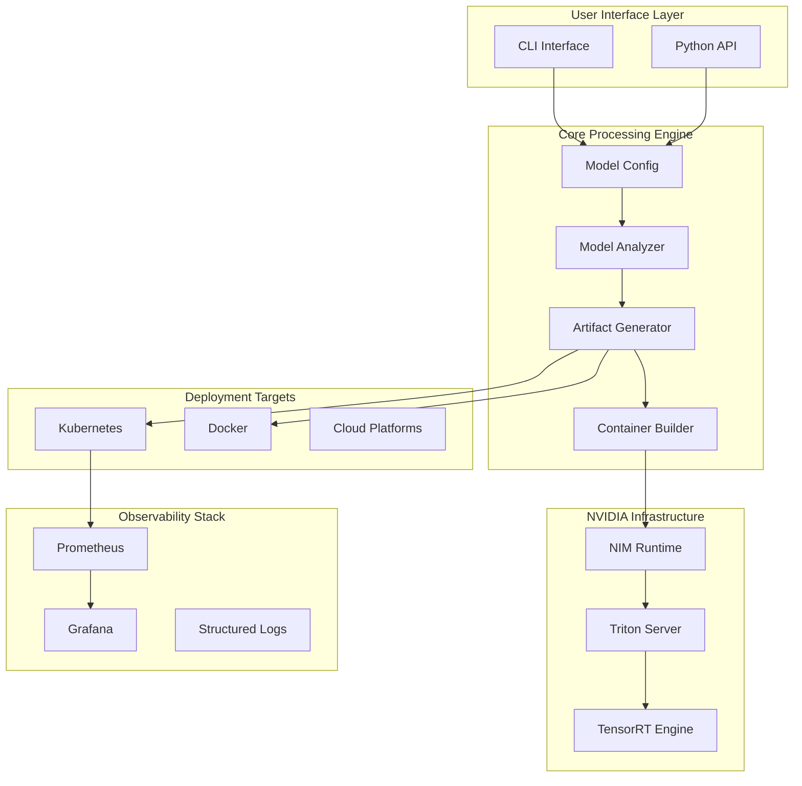
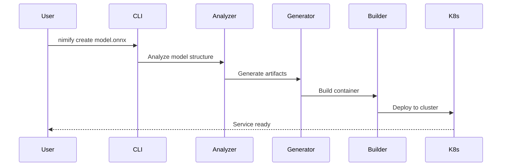

# Architecture Overview

## System Design

Nimify Anything follows a modular, cloud-native architecture designed for extensibility, scalability, and production readiness. The system transforms ML models into enterprise-grade microservices with minimal configuration.

## High-Level Architecture

## Core Components

### 1. CLI Interface (`src/nimify/cli.py`)
- **Purpose**: Primary user interface for all operations
- **Framework**: Click for robust command-line parsing and validation
- **Commands**: `create`, `build`, `deploy`, `monitor`, `validate`
- **Features**: Auto-completion, progress bars, colored output

### 2. Core Engine (`src/nimify/core.py`)
- **ModelConfig**: Centralized configuration management with validation
- **Nimifier**: Main orchestration class handling the end-to-end pipeline
- **NIMService**: Service abstraction with lifecycle management
- **ModelAnalyzer**: Introspects model files for optimal configuration

### 3. Model Processing Pipeline

## Detailed Data Flow

### Phase 1: Model Analysis
1. **Input Validation**: Verify model file format and accessibility
2. **Structure Analysis**: Extract input/output shapes, data types
3. **Optimization Assessment**: Determine TensorRT compatibility
4. **Resource Estimation**: Calculate memory and compute requirements

### Phase 2: Artifact Generation
1. **OpenAPI Specification**: Type-safe API definitions
2. **Triton Configuration**: Model repository setup
3. **Container Definition**: Multi-stage Dockerfile with security hardening
4. **Helm Charts**: Production-ready Kubernetes manifests
5. **Monitoring Config**: Prometheus rules and Grafana dashboards

### Phase 3: Container Build
1. **Base Image Selection**: Optimized NVIDIA runtime images
2. **Model Integration**: Secure model embedding
3. **Security Scanning**: Vulnerability assessment
4. **Performance Optimization**: Layer caching and size reduction

### Phase 4: Deployment
1. **Environment Preparation**: Namespace and RBAC setup
2. **Service Deployment**: Rolling updates with health checks
3. **Autoscaling Configuration**: HPA with custom metrics
4. **Monitoring Activation**: Metrics collection and alerting

## Integration Points

### NVIDIA NIM Runtime
- Leverages Triton Inference Server as the backend
- Integrates with NVIDIA's optimization libraries
- Supports GPU acceleration and batching

### Kubernetes
- Generates Helm charts for production deployment
- Configures autoscaling based on GPU utilization
- Includes monitoring and observability

### Monitoring Stack
- Prometheus metrics collection
- Grafana dashboard templates
- Custom NIM-specific metrics

## Extensibility

The architecture supports:
- Custom preprocessors and postprocessors
- Additional model formats
- Multiple deployment targets
- Custom metric collectors

## Security Considerations

- Model validation and scanning
- Secure container builds
- RBAC for Kubernetes deployments
- Secrets management integration