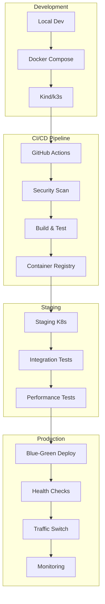

# Advanced Deployment Guide

## Overview

This guide covers advanced deployment strategies for nimify-anything across different environments, from local development to enterprise production deployments.

## Deployment Architecture



## Local Development Deployment

### Docker Compose Setup

```yaml
# docker-compose.dev.yml
version: '3.8'
services:
  nimify:
    build:
      context: .
      target: development
    ports:
      - "8000:8000"
      - "8001:8001"  # gRPC
      - "8002:8002"  # Metrics
    volumes:
      - ./src:/app/src
      - ./models:/app/models
    environment:
      - NIMIFY_ENV=development
      - NIMIFY_LOG_LEVEL=debug
      - NIMIFY_MODEL_CACHE=/app/models
    depends_on:
      - redis
      - prometheus
      
  redis:
    image: redis:7-alpine
    ports:
      - "6379:6379"
    volumes:
      - redis_data:/data
      
  prometheus:
    image: prom/prometheus:latest
    ports:
      - "9090:9090"
    volumes:
      - ./monitoring/prometheus.yml:/etc/prometheus/prometheus.yml
      - prometheus_data:/prometheus
      
  grafana:
    image: grafana/grafana:latest
    ports:
      - "3000:3000"
    environment:
      - GF_SECURITY_ADMIN_PASSWORD=admin
    volumes:
      - ./monitoring/dashboards:/etc/grafana/provisioning/dashboards
      - grafana_data:/var/lib/grafana

volumes:
  redis_data:
  prometheus_data:
  grafana_data:
```

### Local Kubernetes (Kind)

```yaml
# kind-config.yaml
kind: Cluster
apiVersion: kind.x-k8s.io/v1alpha4
name: nimify-dev
nodes:
- role: control-plane
  kubeadmConfigPatches:
  - |
    kind: InitConfiguration
    nodeRegistration:
      kubeletExtraArgs:
        node-labels: "ingress-ready=true"
  extraPortMappings:
  - containerPort: 80
    hostPort: 8080
  - containerPort: 443
    hostPort: 8443
- role: worker
  extraMounts:
  - hostPath: ./models
    containerPath: /models
```

```bash
# Setup local Kubernetes
kind create cluster --config kind-config.yaml
kubectl apply -f https://raw.githubusercontent.com/kubernetes/ingress-nginx/main/deploy/static/provider/kind/deploy.yaml

# Deploy to local cluster
helm install nimify-dev ./helm/nimify \
  --set image.tag=dev \
  --set environment=development \
  --set ingress.enabled=true \
  --set ingress.hosts[0].host=nimify.local
```

## Staging Deployment

### Infrastructure as Code (Terraform)

```hcl
# terraform/staging/main.tf
module "gke_cluster" {
  source = "../modules/gke"
  
  cluster_name     = "nimify-staging"
  region          = "us-central1"
  node_count      = 3
  machine_type    = "n1-standard-4"
  gpu_type        = "nvidia-tesla-t4"
  gpu_count       = 1
  
  tags = {
    Environment = "staging"
    Project     = "nimify-anything"
  }
}

module "monitoring" {
  source = "../modules/monitoring"
  
  cluster_endpoint = module.gke_cluster.endpoint
  namespace       = "nimify-system"
  
  prometheus_retention = "15d"
  grafana_admin_password = var.grafana_password
}

module "security" {
  source = "../modules/security"
  
  cluster_name = module.gke_cluster.name
  falco_enabled = true
  opa_gatekeeper_enabled = true
}
```

### Helm Values for Staging

```yaml
# helm/values-staging.yaml
replicaCount: 3

image:
  repository: ghcr.io/yourusername/nimify-anything
  tag: staging
  pullPolicy: Always

resources:
  limits:
    nvidia.com/gpu: 1
    memory: 8Gi
    cpu: 2000m
  requests:
    nvidia.com/gpu: 1
    memory: 4Gi
    cpu: 1000m

autoscaling:
  enabled: true
  minReplicas: 3
  maxReplicas: 10
  targetCPUUtilizationPercentage: 70
  targetGPUUtilizationPercentage: 80

service:
  type: LoadBalancer
  port: 80
  targetPort: 8000

ingress:
  enabled: true
  className: nginx
  annotations:
    cert-manager.io/cluster-issuer: letsencrypt-prod
    nginx.ingress.kubernetes.io/rate-limit: "100"
  hosts:
    - host: staging.nimify.internal
      paths:
        - path: /
          pathType: Prefix
  tls:
    - secretName: nimify-staging-tls
      hosts:
        - staging.nimify.internal

monitoring:
  prometheus:
    enabled: true
    serviceMonitor:
      enabled: true
  grafana:
    enabled: true
    dashboards:
      enabled: true

security:
  podSecurityPolicy:
    enabled: true
  networkPolicy:
    enabled: true
  serviceAccount:
    create: true
    annotations:
      iam.gke.io/gcp-service-account: nimify-staging@project.iam.gserviceaccount.com

persistence:
  enabled: true
  storageClass: ssd
  size: 100Gi

config:
  environment: staging
  logLevel: info
  metricsEnabled: true
  tracingEnabled: true
  
  triton:
    modelRepository: /models
    httpPort: 8000
    grpcPort: 8001
    metricsPort: 8002
    
  nim:
    cacheSize: 10GB
    maxBatchSize: 32
    maxQueueSize: 100
```

### Staging Deployment Script

```bash
#!/bin/bash
# scripts/deploy-staging.sh

set -euo pipefail

NAMESPACE="nimify-staging"
RELEASE_NAME="nimify-staging"
IMAGE_TAG=${1:-latest}

echo "🚀 Deploying nimify-anything to staging..."

# Ensure namespace exists
kubectl create namespace $NAMESPACE --dry-run=client -o yaml | kubectl apply -f -

# Apply any required secrets
kubectl apply -f k8s/secrets/ -n $NAMESPACE

# Deploy with Helm
helm upgrade --install $RELEASE_NAME ./helm/nimify \
  --namespace $NAMESPACE \
  --values helm/values-staging.yaml \
  --set image.tag=$IMAGE_TAG \
  --wait \
  --timeout=10m

# Wait for deployment to be ready
kubectl rollout status deployment/$RELEASE_NAME -n $NAMESPACE

# Run health checks
echo "🔍 Running health checks..."
kubectl wait --for=condition=ready pod -l app.kubernetes.io/name=nimify -n $NAMESPACE --timeout=300s

# Test the deployment
STAGING_URL=$(kubectl get ingress $RELEASE_NAME -n $NAMESPACE -o jsonpath='{.spec.rules[0].host}')
curl -f https://$STAGING_URL/health || {
  echo "❌ Health check failed"
  exit 1
}

echo "✅ Staging deployment successful"
echo "🌐 Access at: https://$STAGING_URL"
```

## Production Deployment

### Blue-Green Deployment Strategy

```bash
#!/bin/bash
# scripts/deploy-production-blue-green.sh

set -euo pipefail

NAMESPACE="nimify-production"
CURRENT_COLOR=$(kubectl get service nimify-production -n $NAMESPACE -o jsonpath='{.spec.selector.version}' 2>/dev/null || echo "blue")
NEW_COLOR=$([ "$CURRENT_COLOR" = "blue" ] && echo "green" || echo "blue")
RELEASE_NAME="nimify-production-$NEW_COLOR"
IMAGE_TAG=${1:-latest}

echo "🚀 Starting Blue-Green deployment..."
echo "📊 Current color: $CURRENT_COLOR"
echo "🎯 New color: $NEW_COLOR"

# Deploy new version
helm upgrade --install $RELEASE_NAME ./helm/nimify \
  --namespace $NAMESPACE \
  --values helm/values-production.yaml \
  --set image.tag=$IMAGE_TAG \
  --set version=$NEW_COLOR \
  --set service.create=false \
  --wait \
  --timeout=15m

# Wait for new deployment to be ready
kubectl rollout status deployment/$RELEASE_NAME -n $NAMESPACE

# Run comprehensive health checks
echo "🔍 Running comprehensive health checks..."

# Basic health check
kubectl exec -n $NAMESPACE deployment/$RELEASE_NAME -- curl -f http://localhost:8000/health

# Load test to verify performance
kubectl run load-test --rm -i --tty --restart=Never \
  --image=peterevans/vegeta:latest \
  -- sh -c "echo 'GET http://nimify-production-$NEW_COLOR:8000/health' | vegeta attack -rate=50 -duration=30s | vegeta report"

# Smoke tests
kubectl exec -n $NAMESPACE deployment/$RELEASE_NAME -- python -c "
import requests
import sys
response = requests.post('http://localhost:8000/v1/predict', json={'input': [1,2,3]})
if response.status_code != 200:
    sys.exit(1)
print('✅ Smoke test passed')
"

# Switch traffic to new version
echo "🔄 Switching traffic to $NEW_COLOR..."
kubectl patch service nimify-production -n $NAMESPACE \
  -p "{\"spec\":{\"selector\":{\"version\":\"$NEW_COLOR\"}}}"

# Monitor for issues
echo "📊 Monitoring for 2 minutes..."
sleep 120

# Check error rates
ERROR_COUNT=$(kubectl logs -n $NAMESPACE -l version=$NEW_COLOR --since=2m | grep -c "ERROR" || echo "0")
if [ "$ERROR_COUNT" -gt "10" ]; then
  echo "❌ High error rate detected, rolling back..."
  kubectl patch service nimify-production -n $NAMESPACE \
    -p "{\"spec\":{\"selector\":{\"version\":\"$CURRENT_COLOR\"}}}"
  exit 1
fi

# Clean up old version
echo "🧹 Cleaning up old version..."
helm uninstall nimify-production-$CURRENT_COLOR -n $NAMESPACE || true

echo "✅ Blue-Green deployment successful"
echo "🎉 Production is now running $NEW_COLOR version"
```

### Canary Deployment with Istio

```yaml
# k8s/canary/virtual-service.yaml
apiVersion: networking.istio.io/v1beta1
kind: VirtualService
metadata:
  name: nimify-canary
spec:
  hosts:
  - nimify.internal
  http:
  - match:
    - headers:
        canary:
          exact: "true"
    route:
    - destination:
        host: nimify-production
        subset: canary
  - route:
    - destination:
        host: nimify-production
        subset: stable
      weight: 90
    - destination:
        host: nimify-production
        subset: canary
      weight: 10
---
apiVersion: networking.istio.io/v1beta1
kind: DestinationRule
metadata:
  name: nimify-canary
spec:
  host: nimify-production
  subsets:
  - name: stable
    labels:
      version: stable
  - name: canary
    labels:
      version: canary
```

### Progressive Deployment with Flagger

```yaml
# k8s/canary/flagger-canary.yaml
apiVersion: flagger.app/v1beta1
kind: Canary
metadata:
  name: nimify-production
spec:
  targetRef:
    apiVersion: apps/v1
    kind: Deployment
    name: nimify-production
  progressDeadlineSeconds: 600
  service:
    port: 8000
    targetPort: 8000
    gateways:
    - public-gateway.istio-system.svc.cluster.local
    hosts:
    - nimify.internal
  analysis:
    interval: 1m
    threshold: 5
    maxWeight: 50
    stepWeight: 5
    metrics:
    - name: request-success-rate
      thresholdRange:
        min: 99
      interval: 1m
    - name: request-duration
      thresholdRange:
        max: 500
      interval: 1m
    - name: gpu-utilization
      thresholdRange:
        max: 90
      interval: 1m
    webhooks:
    - name: load-test
      url: http://flagger-loadtester.test/
      timeout: 5s
      metadata:
        cmd: "hey -z 1m -q 10 -c 2 http://nimify.internal/"
```

## Multi-Cloud Deployment

### AWS EKS Deployment

```yaml
# terraform/aws/eks.tf
module "eks" {
  source = "terraform-aws-modules/eks/aws"
  
  cluster_name    = "nimify-production"
  cluster_version = "1.27"
  
  vpc_id     = module.vpc.vpc_id
  subnet_ids = module.vpc.private_subnets
  
  node_groups = {
    gpu_nodes = {
      desired_capacity = 3
      max_capacity     = 10
      min_capacity     = 3
      
      instance_types = ["p3.2xlarge"]
      k8s_labels = {
        Environment = "production"
        NodeType    = "gpu"
      }
      
      additional_tags = {
        "k8s.io/cluster-autoscaler/enabled" = "true"
        "k8s.io/cluster-autoscaler/nimify-production" = "owned"
      }
    }
  }
  
  tags = {
    Environment = "production"
    Project     = "nimify-anything"
  }
}

# Install NVIDIA device plugin
resource "helm_release" "nvidia_device_plugin" {
  name       = "nvidia-device-plugin"
  repository = "https://nvidia.github.io/k8s-device-plugin"
  chart      = "nvidia-device-plugin"
  namespace  = "kube-system"
  
  depends_on = [module.eks]
}
```

### Azure AKS Deployment

```yaml
# terraform/azure/aks.tf
resource "azurerm_kubernetes_cluster" "main" {
  name                = "nimify-production"
  location            = azurerm_resource_group.main.location
  resource_group_name = azurerm_resource_group.main.name
  dns_prefix          = "nimify-production"
  
  default_node_pool {
    name       = "default"
    node_count = 3
    vm_size    = "Standard_D2_v2"
  }
  
  identity {
    type = "SystemAssigned"
  }
}

resource "azurerm_kubernetes_cluster_node_pool" "gpu" {
  name                  = "gpu"
  kubernetes_cluster_id = azurerm_kubernetes_cluster.main.id
  vm_size              = "Standard_NC6s_v3"
  node_count           = 3
  
  node_taints = ["nvidia.com/gpu=true:NoSchedule"]
  
  tags = {
    Environment = "production"
    NodeType    = "gpu"
  }
}
```

### GCP GKE Deployment

```yaml
# terraform/gcp/gke.tf
resource "google_container_cluster" "primary" {
  name     = "nimify-production"
  location = "us-central1"
  
  remove_default_node_pool = true
  initial_node_count       = 1
  
  workload_identity_config {
    workload_pool = "${var.project_id}.svc.id.goog"
  }
  
  addons_config {
    http_load_balancing {
      disabled = false
    }
    
    horizontal_pod_autoscaling {
      disabled = false
    }
  }
}

resource "google_container_node_pool" "gpu_nodes" {
  name       = "gpu-pool"
  location   = "us-central1"
  cluster    = google_container_cluster.primary.name
  node_count = 3
  
  node_config {
    preemptible  = false
    machine_type = "n1-standard-4"
    
    guest_accelerator {
      type  = "nvidia-tesla-t4"
      count = 1
    }
    
    oauth_scopes = [
      "https://www.googleapis.com/auth/logging.write",
      "https://www.googleapis.com/auth/monitoring",
    ]
    
    taint {
      key    = "nvidia.com/gpu"
      value  = "true"
      effect = "NO_SCHEDULE"
    }
  }
  
  autoscaling {
    min_node_count = 1
    max_node_count = 10
  }
}
```

## Disaster Recovery

### Backup Strategy

```yaml
# k8s/backup/velero-backup.yaml
apiVersion: velero.io/v1
kind: Schedule
metadata:
  name: nimify-daily-backup
spec:
  schedule: "0 1 * * *"  # Daily at 1 AM
  template:
    includedNamespaces:
    - nimify-production
    includedResources:
    - persistentvolumes
    - persistentvolumeclaims
    - secrets
    - configmaps
    - deployments
    - services
    excludedResources:
    - pods
    - replicasets
    storageLocation: default
    ttl: "720h"  # 30 days
    hooks:
      resources:
      - name: model-backup
        includedNamespaces:
        - nimify-production
        labelSelector:
          matchLabels:
            app: nimify
        hooks:
        - exec:
            container: nimify
            command:
            - /bin/bash
            - -c
            - "tar -czf /backup/models-$(date +%Y%m%d).tar.gz /models"
            onError: Continue
```

### Multi-Region Setup

```yaml
# k8s/multi-region/kustomization.yaml
apiVersion: kustomize.config.k8s.io/v1beta1
kind: Kustomization

resources:
- ../base

patches:
- patch: |-
    - op: replace
      path: /spec/replicas
      value: 5
  target:
    kind: Deployment
    name: nimify-production

- patch: |-
    - op: add
      path: /spec/template/spec/affinity
      value:
        podAntiAffinity:
          requiredDuringSchedulingIgnoredDuringExecution:
          - labelSelector:
              matchExpressions:
              - key: app
                operator: In
                values:
                - nimify
            topologyKey: failure-domain.beta.kubernetes.io/zone
  target:
    kind: Deployment
    name: nimify-production
```

## Monitoring and Observability

### Production Monitoring Stack

```yaml
# monitoring/production/kustomization.yaml
apiVersion: kustomize.config.k8s.io/v1beta1
kind: Kustomization

resources:
- prometheus-operator
- grafana
- jaeger
- loki

configMapGenerator:
- name: prometheus-config
  files:
  - prometheus.yml
  - alert-rules.yml

- name: grafana-dashboards
  files:
  - dashboards/nimify-overview.json
  - dashboards/gpu-metrics.json
  - dashboards/triton-metrics.json
```

### Alerting Rules

```yaml
# monitoring/alert-rules.yml
groups:
- name: nimify.rules
  rules:
  - alert: NimifyHighErrorRate
    expr: rate(nimify_request_errors_total[5m]) > 0.1
    for: 2m
    labels:
      severity: critical
    annotations:
      summary: "High error rate in Nimify service"
      description: "Error rate is {{ $value }} errors per second"

  - alert: NimifyHighLatency
    expr: histogram_quantile(0.95, rate(nimify_request_duration_seconds_bucket[5m])) > 1
    for: 5m
    labels:
      severity: warning
    annotations:
      summary: "High latency in Nimify service"
      description: "95th percentile latency is {{ $value }} seconds"

  - alert: GPUUtilizationHigh
    expr: nvidia_gpu_utilization > 90
    for: 10m
    labels:
      severity: warning
    annotations:
      summary: "GPU utilization is high"
      description: "GPU utilization is {{ $value }}%"
```

## Security Hardening

### Pod Security Standards

```yaml
# k8s/security/pod-security-policy.yaml
apiVersion: policy/v1beta1
kind: PodSecurityPolicy
metadata:
  name: nimify-psp
spec:
  privileged: false
  allowPrivilegeEscalation: false
  requiredDropCapabilities:
    - ALL
  volumes:
    - 'configMap'
    - 'emptyDir'
    - 'projected'
    - 'secret'
    - 'downwardAPI'
    - 'persistentVolumeClaim'
  runAsUser:
    rule: 'RunAsAny'
  seLinux:
    rule: 'RunAsAny'
  fsGroup:
    rule: 'RunAsAny'
```

### Network Policies

```yaml
# k8s/security/network-policy.yaml
apiVersion: networking.k8s.io/v1
kind: NetworkPolicy
metadata:
  name: nimify-network-policy
spec:
  podSelector:
    matchLabels:
      app: nimify
  policyTypes:
  - Ingress
  - Egress
  ingress:
  - from:
    - namespaceSelector:
        matchLabels:
          name: istio-system
    - podSelector:
        matchLabels:
          app: prometheus
    ports:
    - protocol: TCP
      port: 8000
    - protocol: TCP
      port: 8002
  egress:
  - to: []
    ports:
    - protocol: TCP
      port: 53
    - protocol: UDP
      port: 53
  - to:
    - podSelector:
        matchLabels:
          app: redis
    ports:
    - protocol: TCP
      port: 6379
```

## Performance Optimization

### Resource Optimization

```yaml
# k8s/performance/hpa-v2.yaml
apiVersion: autoscaling/v2
kind: HorizontalPodAutoscaler
metadata:
  name: nimify-hpa
spec:
  scaleTargetRef:
    apiVersion: apps/v1
    kind: Deployment
    name: nimify-production
  minReplicas: 3
  maxReplicas: 20
  metrics:
  - type: Resource
    resource:
      name: cpu
      target:
        type: Utilization
        averageUtilization: 70
  - type: Resource
    resource:
      name: nvidia.com/gpu
      target:
        type: Utilization
        averageUtilization: 80
  - type: Pods
    pods:
      metric:
        name: nimify_request_duration_p95
      target:
        type: AverageValue
        averageValue: "500m"
  behavior:
    scaleDown:
      stabilizationWindowSeconds: 300
      policies:
      - type: Percent
        value: 10
        periodSeconds: 60
    scaleUp:
      stabilizationWindowSeconds: 60
      policies:
      - type: Percent
        value: 50
        periodSeconds: 60
```

This comprehensive deployment guide provides enterprise-grade deployment strategies suitable for an advanced ML/AI infrastructure project like nimify-anything.