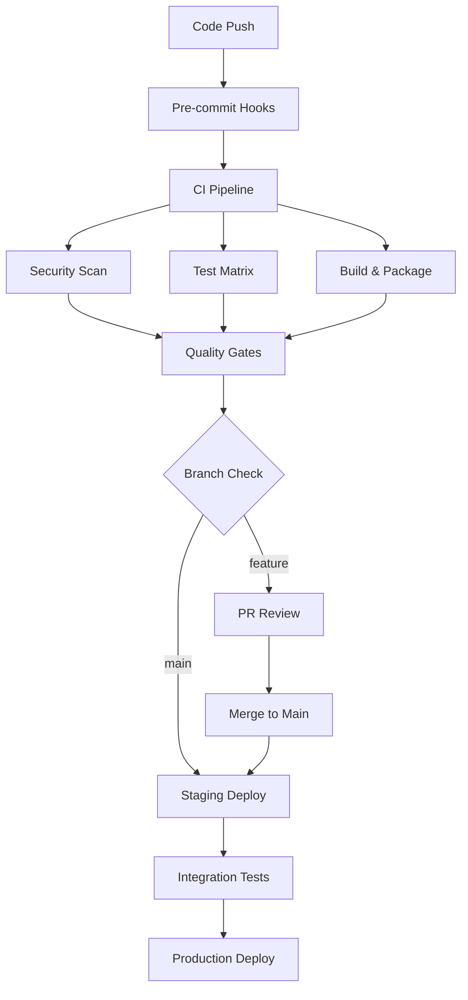

# Advanced CI/CD Workflows for Nimify-Anything

## Overview

This document provides advanced CI/CD workflow configurations for the nimify-anything project. Due to GitHub Actions requiring manual setup, this guide provides complete workflow templates and integration strategies.

## Core CI/CD Strategy

### Multi-Stage Pipeline Architecture



## Workflow Templates

### 1. Comprehensive CI Workflow

**File: `.github/workflows/ci.yml`**

```yaml
name: Comprehensive CI/CD Pipeline

on:
  push:
    branches: [main, develop]
  pull_request:
    branches: [main, develop]
  schedule:
    - cron: '0 2 * * 1'  # Weekly security scan

env:
  PYTHON_VERSION: '3.10'
  NODE_VERSION: '18'
  DOCKER_REGISTRY: ghcr.io
  IMAGE_NAME: ${{ github.repository }}

jobs:
  security-scan:
    name: Security & Compliance Scan
    runs-on: ubuntu-latest
    permissions:
      security-events: write
    steps:
      - uses: actions/checkout@v4
        with:
          fetch-depth: 0

      - name: Set up Python
        uses: actions/setup-python@v4
        with:
          python-version: ${{ env.PYTHON_VERSION }}

      - name: Install security tools
        run: |
          pip install bandit[toml] safety detect-secrets semgrep

      - name: Run Bandit security scan
        run: |
          bandit -r src -f sarif -o bandit-results.sarif
        continue-on-error: true

      - name: Upload Bandit results to GitHub Security
        uses: github/codeql-action/upload-sarif@v2
        if: always()
        with:
          sarif_file: bandit-results.sarif

      - name: Check for secrets
        run: |
          detect-secrets scan --baseline .secrets.baseline --force-use-all-plugins

      - name: Run safety check
        run: |
          safety check --json --output safety-report.json
        continue-on-error: true

      - name: Run Semgrep
        run: |
          semgrep --config=auto --sarif --output=semgrep.sarif src/
        continue-on-error: true

      - name: Upload Semgrep results
        uses: github/codeql-action/upload-sarif@v2
        if: always()
        with:
          sarif_file: semgrep.sarif

  test-matrix:
    name: Test Matrix
    runs-on: ${{ matrix.os }}
    strategy:
      fail-fast: false
      matrix:
        os: [ubuntu-latest, windows-latest, macos-latest]
        python-version: ['3.10', '3.11', '3.12']
        include:
          - os: ubuntu-latest
            python-version: '3.10'
            cuda: true
    
    steps:
      - uses: actions/checkout@v4

      - name: Set up Python ${{ matrix.python-version }}
        uses: actions/setup-python@v4
        with:
          python-version: ${{ matrix.python-version }}

      - name: Set up CUDA (Ubuntu only)
        if: matrix.cuda
        uses: Jimver/cuda-toolkit@v0.2.11
        with:
          cuda: '11.7'

      - name: Install dependencies
        run: |
          python -m pip install --upgrade pip
          pip install -e .[dev,test]

      - name: Run linting
        run: |
          black --check src tests
          ruff check src tests
          mypy src

      - name: Run tests with coverage
        run: |
          pytest --cov=src --cov-report=xml --cov-report=html -v

      - name: Upload coverage to Codecov
        uses: codecov/codecov-action@v3
        if: matrix.os == 'ubuntu-latest' && matrix.python-version == '3.10'
        with:
          file: ./coverage.xml
          fail_ci_if_error: true

  performance-tests:
    name: Performance & Load Tests
    runs-on: ubuntu-latest
    needs: [test-matrix]
    services:
      redis:
        image: redis:7-alpine
        ports:
          - 6379:6379
    
    steps:
      - uses: actions/checkout@v4

      - name: Set up Python
        uses: actions/setup-python@v4
        with:
          python-version: ${{ env.PYTHON_VERSION }}

      - name: Install dependencies
        run: |
          pip install -e .[dev,test]
          pip install locust

      - name: Run performance tests
        run: |
          pytest tests/performance/ -v --benchmark-only

      - name: Run load tests
        run: |
          timeout 300 locust --headless --users 50 --spawn-rate 5 \
            --run-time 120s --host http://localhost:8000 || true

  build-and-push:
    name: Build & Push Container
    runs-on: ubuntu-latest
    needs: [security-scan, test-matrix]
    if: github.event_name == 'push' && github.ref == 'refs/heads/main'
    permissions:
      contents: read
      packages: write
    
    steps:
      - uses: actions/checkout@v4

      - name: Set up Docker Buildx
        uses: docker/setup-buildx-action@v3

      - name: Log in to Container Registry
        uses: docker/login-action@v3
        with:
          registry: ${{ env.DOCKER_REGISTRY }}
          username: ${{ github.actor }}
          password: ${{ secrets.GITHUB_TOKEN }}

      - name: Extract metadata
        id: meta
        uses: docker/metadata-action@v5
        with:
          images: ${{ env.DOCKER_REGISTRY }}/${{ env.IMAGE_NAME }}
          tags: |
            type=ref,event=branch
            type=ref,event=pr
            type=sha,prefix={{branch}}-
            type=raw,value=latest,enable={{is_default_branch}}

      - name: Build and push Docker image
        uses: docker/build-push-action@v5
        with:
          context: .
          push: true
          tags: ${{ steps.meta.outputs.tags }}
          labels: ${{ steps.meta.outputs.labels }}
          cache-from: type=gha
          cache-to: type=gha,mode=max
          platforms: linux/amd64,linux/arm64

      - name: Generate SBOM
        uses: anchore/sbom-action@v0.14.3
        with:
          image: ${{ env.DOCKER_REGISTRY }}/${{ env.IMAGE_NAME }}:${{ github.sha }}
          format: spdx-json
          output-file: sbom.spdx.json

      - name: Upload SBOM artifact
        uses: actions/upload-artifact@v3
        with:
          name: sbom
          path: sbom.spdx.json

  integration-tests:
    name: Integration Tests
    runs-on: ubuntu-latest
    needs: [build-and-push]
    if: github.event_name == 'push' && github.ref == 'refs/heads/main'
    
    steps:
      - uses: actions/checkout@v4

      - name: Set up Python
        uses: actions/setup-python@v4
        with:
          python-version: ${{ env.PYTHON_VERSION }}

      - name: Install dependencies
        run: |
          pip install -e .[dev,test]
          pip install testcontainers

      - name: Run integration tests
        run: |
          pytest tests/integration/ -v
        env:
          DOCKER_IMAGE: ${{ env.DOCKER_REGISTRY }}/${{ env.IMAGE_NAME }}:${{ github.sha }}

  deploy-staging:
    name: Deploy to Staging
    runs-on: ubuntu-latest
    needs: [integration-tests]
    if: github.event_name == 'push' && github.ref == 'refs/heads/main'
    environment: staging
    
    steps:
      - uses: actions/checkout@v4

      - name: Set up kubectl
        uses: azure/setup-kubectl@v3
        with:
          version: 'v1.27.3'

      - name: Configure kubectl
        run: |
          echo "${{ secrets.KUBE_CONFIG_STAGING }}" | base64 -d > ~/.kube/config

      - name: Deploy to staging
        run: |
          helm upgrade --install nimify-staging ./helm/nimify \
            --namespace staging \
            --set image.tag=${{ github.sha }} \
            --set environment=staging \
            --wait --timeout=10m

      - name: Run smoke tests
        run: |
          kubectl wait --for=condition=ready pod -l app=nimify-staging -n staging --timeout=300s
          curl -f http://staging.nimify.internal/health || exit 1

  deploy-production:
    name: Deploy to Production
    runs-on: ubuntu-latest
    needs: [deploy-staging]
    if: github.event_name == 'push' && github.ref == 'refs/heads/main'
    environment: production
    
    steps:
      - uses: actions/checkout@v4

      - name: Set up kubectl
        uses: azure/setup-kubectl@v3
        with:
          version: 'v1.27.3'

      - name: Configure kubectl
        run: |
          echo "${{ secrets.KUBE_CONFIG_PRODUCTION }}" | base64 -d > ~/.kube/config

      - name: Deploy to production (Blue-Green)
        run: |
          # Blue-Green deployment strategy
          helm upgrade --install nimify-production ./helm/nimify \
            --namespace production \
            --set image.tag=${{ github.sha }} \
            --set environment=production \
            --set strategy=blue-green \
            --wait --timeout=15m

      - name: Health check and traffic switch
        run: |
          # Wait for new deployment
          kubectl wait --for=condition=ready pod -l app=nimify-production,version=green -n production --timeout=600s
          
          # Run health checks
          kubectl exec -n production deploy/nimify-production-green -- curl -f http://localhost:8000/health
          
          # Switch traffic
          kubectl patch service nimify-production -n production \
            -p '{"spec":{"selector":{"version":"green"}}}'
          
          # Clean up old version after successful switch
          sleep 60
          kubectl delete deployment nimify-production-blue -n production --ignore-not-found=true

  notify:
    name: Notifications
    runs-on: ubuntu-latest
    needs: [deploy-production]
    if: always()
    
    steps:
      - name: Notify Slack on success
        if: needs.deploy-production.result == 'success'
        uses: rtCamp/action-slack-notify@v2
        env:
          SLACK_WEBHOOK: ${{ secrets.SLACK_WEBHOOK }}
          SLACK_CHANNEL: deployments
          SLACK_COLOR: good
          SLACK_MESSAGE: "✅ Nimify-Anything deployed successfully to production"

      - name: Notify Slack on failure
        if: failure()
        uses: rtCamp/action-slack-notify@v2
        env:
          SLACK_WEBHOOK: ${{ secrets.SLACK_WEBHOOK }}
          SLACK_CHANNEL: alerts
          SLACK_COLOR: danger
          SLACK_MESSAGE: "❌ Nimify-Anything deployment failed - ${{ github.sha }}"
```

## Advanced Security Workflow

**File: `.github/workflows/security.yml`**

```yaml
name: Advanced Security Scanning

on:
  schedule:
    - cron: '0 3 * * 1'  # Weekly Monday 3 AM
  workflow_dispatch:
  push:
    paths:
      - 'src/**'
      - 'requirements.txt'
      - 'pyproject.toml'

jobs:
  dependency-security:
    name: Dependency Security Scan
    runs-on: ubuntu-latest
    permissions:
      security-events: write
    
    steps:
      - uses: actions/checkout@v4

      - name: Set up Python
        uses: actions/setup-python@v4
        with:
          python-version: '3.10'

      - name: Install pip-audit
        run: pip install pip-audit

      - name: Run pip-audit
        run: |
          pip-audit --requirement requirements.txt --format=sarif --output=pip-audit.sarif
        continue-on-error: true

      - name: Upload pip-audit results
        uses: github/codeql-action/upload-sarif@v2
        if: always()
        with:
          sarif_file: pip-audit.sarif

  container-security:
    name: Container Security Scan
    runs-on: ubuntu-latest
    
    steps:
      - uses: actions/checkout@v4

      - name: Build container for scanning
        run: |
          docker build -t nimify-scan .

      - name: Run Trivy vulnerability scanner
        uses: aquasecurity/trivy-action@master
        with:
          image-ref: nimify-scan
          format: sarif
          output: trivy-results.sarif

      - name: Upload Trivy scan results to GitHub Security
        uses: github/codeql-action/upload-sarif@v2
        if: always()
        with:
          sarif_file: trivy-results.sarif

      - name: Run Grype vulnerability scanner
        uses: anchore/scan-action@v3
        with:
          image: nimify-scan
          fail-build: false
          severity-cutoff: high

  secrets-scan:
    name: Advanced Secrets Scanning
    runs-on: ubuntu-latest
    
    steps:
      - uses: actions/checkout@v4
        with:
          fetch-depth: 0

      - name: Run TruffleHog
        uses: trufflesecurity/trufflehog@main
        with:
          path: ./
          base: main
          head: HEAD
          extra_args: --debug --only-verified

  supply-chain:
    name: Supply Chain Security
    runs-on: ubuntu-latest
    
    steps:
      - uses: actions/checkout@v4

      - name: SLSA Provenance
        uses: slsa-framework/slsa-github-generator/.github/workflows/generator_generic_slsa3.yml@v1.7.0
        with:
          base64-subjects: "${{ needs.build.outputs.hashes }}"

      - name: Generate SBOM
        uses: anchore/sbom-action@v0.14.3
        with:
          path: .
          format: spdx-json
          output-file: sbom.spdx.json

      - name: Upload SBOM
        uses: actions/upload-artifact@v3
        with:
          name: sbom
          path: sbom.spdx.json
```

## Release Automation Workflow

**File: `.github/workflows/release.yml`**

```yaml
name: Automated Release

on:
  push:
    tags:
      - 'v*'

env:
  PYTHON_VERSION: '3.10'

jobs:
  create-release:
    name: Create Release
    runs-on: ubuntu-latest
    permissions:
      contents: write
      packages: write
    
    steps:
      - uses: actions/checkout@v4
        with:
          fetch-depth: 0

      - name: Set up Python
        uses: actions/setup-python@v4
        with:
          python-version: ${{ env.PYTHON_VERSION }}

      - name: Install build dependencies
        run: |
          pip install build twine

      - name: Build package
        run: |
          python -m build

      - name: Test package
        run: |
          pip install dist/*.whl
          nimify --version

      - name: Publish to PyPI
        env:
          TWINE_USERNAME: __token__
          TWINE_PASSWORD: ${{ secrets.PYPI_API_TOKEN }}
        run: |
          twine upload dist/*

      - name: Build and push Docker image
        uses: docker/build-push-action@v5
        with:
          context: .
          push: true
          tags: |
            ghcr.io/${{ github.repository }}:${{ github.ref_name }}
            ghcr.io/${{ github.repository }}:latest
          platforms: linux/amd64,linux/arm64

      - name: Generate changelog
        run: |
          git log --pretty=format:"- %s" $(git describe --tags --abbrev=0 HEAD^)..HEAD > CHANGELOG_LATEST.md

      - name: Create GitHub Release
        uses: softprops/action-gh-release@v1
        with:
          body_path: CHANGELOG_LATEST.md
          files: |
            dist/*.whl
            dist/*.tar.gz
          draft: false
          prerelease: ${{ contains(github.ref_name, 'rc') || contains(github.ref_name, 'beta') || contains(github.ref_name, 'alpha') }}
```

## Required Secrets Configuration

Add these secrets to your GitHub repository settings:

```bash
# Container Registry
GITHUB_TOKEN  # Automatically provided

# PyPI Publishing
PYPI_API_TOKEN

# Kubernetes Deployment
KUBE_CONFIG_STAGING    # Base64 encoded kubeconfig
KUBE_CONFIG_PRODUCTION # Base64 encoded kubeconfig

# Notifications
SLACK_WEBHOOK

# Optional: Third-party integrations
CODECOV_TOKEN
SONAR_TOKEN
```

## Environment Configuration

### Staging Environment

```yaml
# Environment: staging
environment:
  name: staging
  url: https://staging.nimify.internal
protection_rules:
  required_reviewers: 1
  wait_timer: 0
```

### Production Environment

```yaml
# Environment: production
environment:
  name: production
  url: https://nimify.internal
protection_rules:
  required_reviewers: 2
  wait_timer: 30  # 30 minute delay
  prevent_self_review: true
```

## Monitoring and Observability

### Workflow Monitoring

```yaml
name: Workflow Health Check

on:
  schedule:
    - cron: '0 8 * * *'  # Daily at 8 AM

jobs:
  check-workflow-health:
    runs-on: ubuntu-latest
    steps:
      - name: Check recent workflow failures
        uses: actions/github-script@v6
        with:
          script: |
            const { data: workflows } = await github.rest.actions.listWorkflowRuns({
              owner: context.repo.owner,
              repo: context.repo.repo,
              status: 'failure',
              created: new Date(Date.now() - 24*60*60*1000).toISOString()
            });
            
            if (workflows.total_count > 5) {
              core.setFailed(`High failure rate: ${workflows.total_count} failed workflows in last 24h`);
            }
```

## Implementation Checklist

- [ ] Create workflow files in `.github/workflows/`
- [ ] Configure repository secrets
- [ ] Set up staging and production environments
- [ ] Configure branch protection rules
- [ ] Set up Slack/notification webhooks
- [ ] Configure container registry access
- [ ] Set up monitoring and alerting
- [ ] Test workflows with feature branch
- [ ] Document team processes and runbooks

## Advanced Features

### Matrix Testing with GPU Support

```yaml
strategy:
  matrix:
    include:
      - os: ubuntu-latest
        python: '3.10'
        gpu: true
        cuda: '11.7'
      - os: ubuntu-latest
        python: '3.11'
        gpu: false
```

### Canary Deployment Strategy

```yaml
- name: Canary deployment
  run: |
    helm upgrade nimify-canary ./helm/nimify \
      --set canary.enabled=true \
      --set canary.weight=10 \
      --set image.tag=${{ github.sha }}
```

### Performance Regression Testing

```yaml
- name: Performance baseline comparison
  run: |
    pytest tests/performance/ --benchmark-compare=baseline.json \
      --benchmark-compare-fail=mean:10%
```

This comprehensive CI/CD setup provides enterprise-grade automation while maintaining security and reliability standards appropriate for an advanced ML/AI infrastructure project.